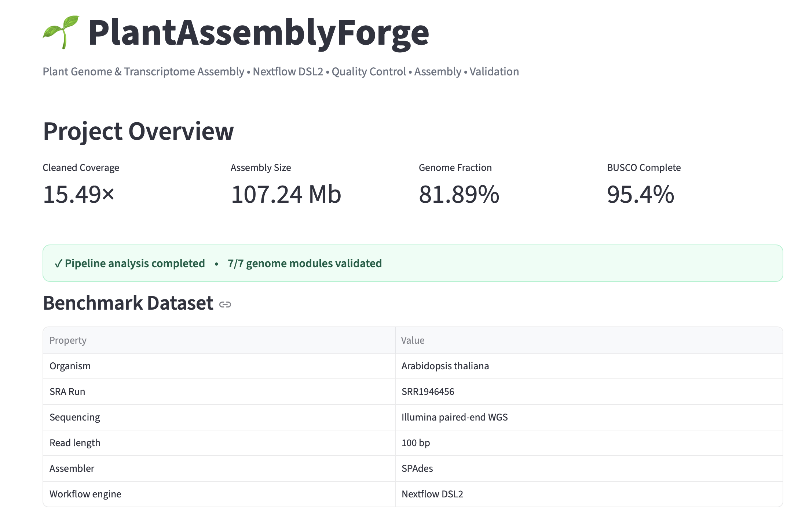
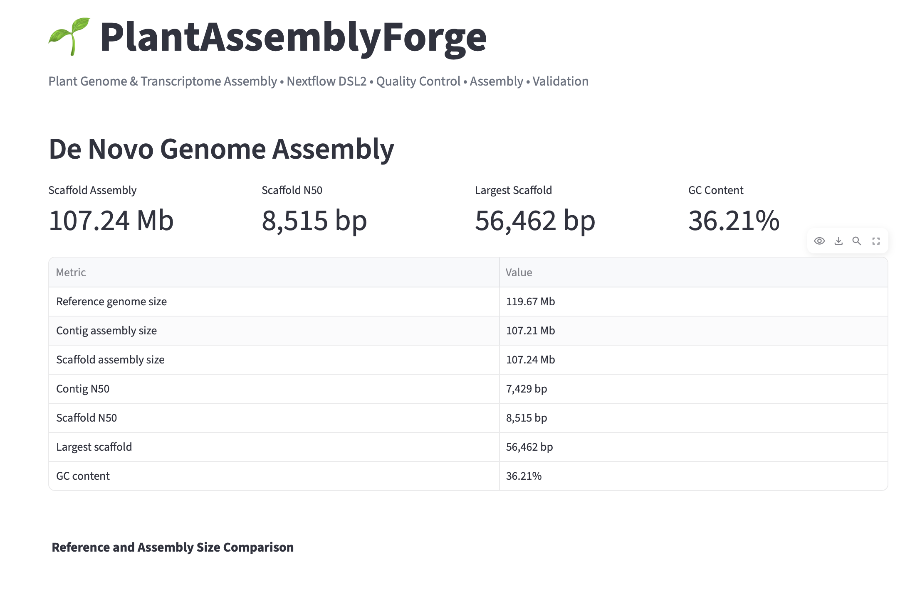
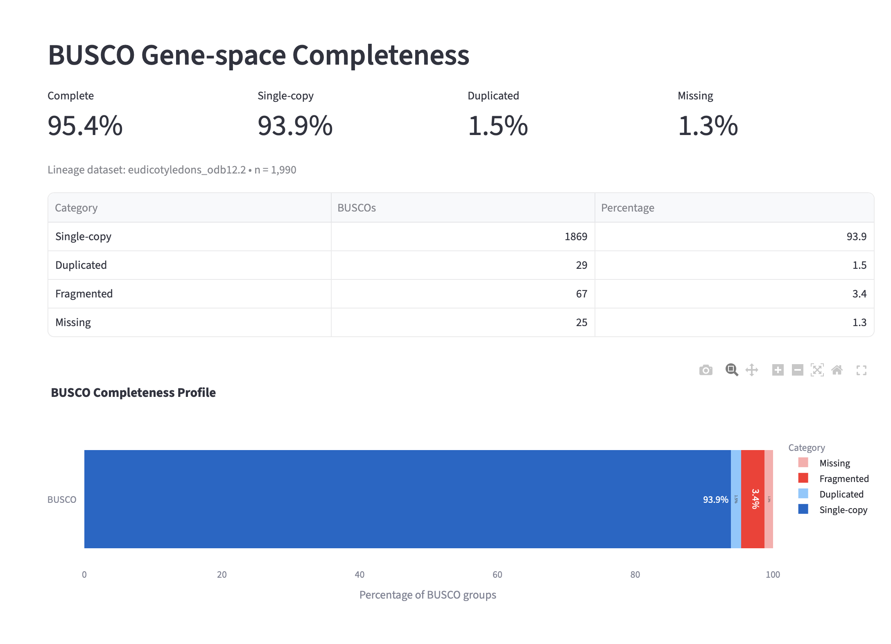
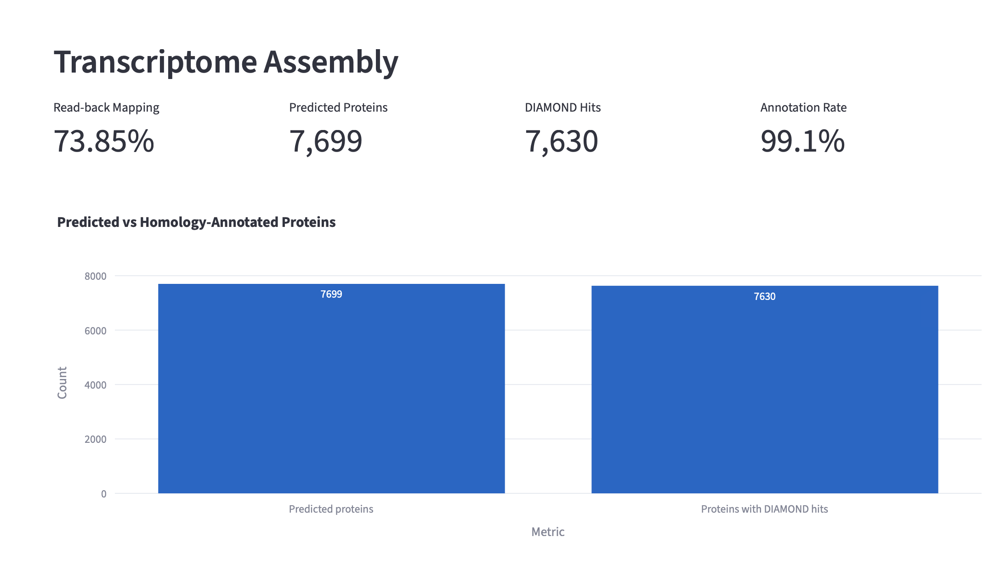

# 🌱 PlantAssemblyForge

### A Reproducible Nextflow DSL2 Platform for Plant Genome and Transcriptome Assembly

PlantAssemblyForge is a modular bioinformatics workflow for **plant de novo genome assembly, transcriptome assembly, quality control, assembly validation, functional analysis, and interactive results visualization**.

The platform combines **Nextflow DSL2** workflow orchestration with established bioinformatics tools and an interactive **Streamlit dashboard**, providing a reproducible workflow from raw sequencing reads to interpretable assembly-quality results.

---

## 🖥️ Interactive Results Dashboard

PlantAssemblyForge includes an interactive Streamlit dashboard for exploring benchmark results, assembly statistics, validation metrics, k-mer distributions, transcriptome outputs, and workflow architecture.

### Project Overview



The overview provides a compact summary of the benchmark dataset and major genome assembly results, including cleaned sequencing coverage, assembly size, genome fraction, and BUSCO completeness.

---

## 🧬 De Novo Genome Assembly

The genome workflow processes paired-end sequencing reads through quality assessment, read preprocessing, k-mer analysis, assembly, and independent assembly validation.

```text
Paired-end FASTQ
        │
        ▼
      FastQC
        │
        ▼
       fastp
        │
        ▼
Post-trimming FastQC
        │
        ├────────────► Jellyfish k-mer analysis
        │
        ▼
      SPAdes
        │
        ├────────────► QUAST
        │
        └────────────► BUSCO
```

### Genome Assembly Dashboard



Representative benchmark statistics include:

| Metric | Result |
|---|---:|
| Scaffold assembly size | 107.24 Mb |
| Contig assembly size | 107.21 Mb |
| Scaffold N50 | 8,515 bp |
| Contig N50 | 7,429 bp |
| Largest scaffold | 56,462 bp |
| GC content | 36.21% |

---

## 📊 QUAST Assembly Evaluation

QUAST is used to evaluate assembly contiguity and reference-based genome recovery.

Representative results include:

| Metric | Result |
|---|---:|
| Genome fraction | 81.892% |
| Duplication ratio | 1.003 |
| Scaffold NGA50 | 5,971 bp |

QUAST outputs are retained in `results_summary/genome/` to provide compact evidence of assembly performance without storing large intermediate files in Git.

---

## 🧬 BUSCO Completeness Assessment

BUSCO evaluates recovery of evolutionarily conserved plant genes and provides an independent measure of biological completeness.



Representative BUSCO results:

| Category | Result |
|---|---:|
| Complete BUSCOs | 95.4% |
| Single-copy | 93.9% |
| Fragmented | 3.4% |
| Missing | 1.3% |

The benchmark demonstrates high recovery of conserved gene content despite fragmentation expected from a moderate-depth short-read de novo assembly.

---

## 🔬 k-mer Analysis

Jellyfish is used to generate the k-mer frequency spectrum before assembly.

The current benchmark uses:

```text
k = 21
```

The resulting spectrum provides information about read multiplicity, sequencing error, coverage structure, and genome complexity.

The representative histogram is available at:

```text
results_summary/genome/k21_histogram.tsv
```

---

## 🧪 Transcriptome Assembly

PlantAssemblyForge also contains modules for **de novo** and **reference-guided transcriptome analysis**.



### De Novo Branch

```text
RNA-seq
   │
   ▼
FastQC
   │
   ▼
fastp
   │
   ▼
RNA-SPAdes
   │
   ▼
Read-back mapping
   │
   ▼
rnaQUAST
   │
   ▼
TransDecoder
   │
   ▼
DIAMOND
```

This branch supports transcript reconstruction, assembly validation, protein prediction, and sequence-similarity-based functional analysis.

### Reference-Guided Branch

```text
RNA-seq
   │
   ▼
HISAT2
   │
   ▼
SAMtools
   │
   ▼
StringTie
```

The reference-guided branch provides an alternative workflow when an appropriate reference genome is available.

---

## ⚙️ Nextflow DSL2 Architecture

PlantAssemblyForge uses modular **Nextflow DSL2** processes to separate individual bioinformatics operations from higher-level workflow logic.

Genome workflow modules include:

```text
GENOME_FASTQC
      │
      ▼
GENOME_FASTP
      │
      ▼
GENOME_FASTQC_CLEAN
      │
      ├────────────► GENOME_JELLYFISH
      │
      ▼
GENOME_SPADES
      │
      ├────────────► GENOME_QUAST
      │
      └────────────► GENOME_BUSCO
```

The genome modules have also been tested using Nextflow stub execution to validate workflow connectivity without rerunning computationally expensive analyses.

---

## 🛠️ Technology Stack

| Category | Tools |
|---|---|
| Workflow management | Nextflow DSL2 |
| Read QC | FastQC, fastp, MultiQC |
| k-mer analysis | Jellyfish |
| Genome assembly | SPAdes |
| Genome validation | QUAST, BUSCO |
| Transcriptome assembly | RNA-SPAdes |
| Alignment | HISAT2, Bowtie2, minimap2 |
| Alignment processing | SAMtools |
| Transcript reconstruction | StringTie |
| Protein prediction | TransDecoder |
| Functional similarity search | DIAMOND |
| Dashboard | Streamlit |
| Data analysis | Python, pandas |
| Visualization | Plotly, Matplotlib |
| Environment management | Conda |

---

## 📁 Repository Structure

```text
PlantAssemblyForge/
│
├── app/
│   └── app.py
│
├── conf/
│   └── genome.config
│
├── config/
│   └── samplesheet.csv
│
├── docs/
│   └── images/
│       ├── overview.png
│       ├── genome_assembly.png
│       ├── busco.png
│       └── transcriptome.png
│
├── modules/
│   ├── alignment/
│   ├── annotation/
│   ├── assembly/
│   ├── genome/
│   ├── qc/
│   └── validation/
│
├── workflows/
│   ├── genome.nf
│   └── transcriptome.nf
│
├── results_summary/
│   ├── RESULTS.md
│   └── genome/
│
├── genome_main.nf
├── main.nf
├── nextflow.config
├── environment.yml
├── CITATION.cff
├── LICENSE
└── README.md
```

---

## 🚀 Installation

Clone the repository:

```bash
git clone https://github.com/Pratik-2002-ux/PlantAssemblyForge.git
cd PlantAssemblyForge
```

Create the Conda environment:

```bash
conda env create -f environment.yml
conda activate plantassembly
```

---

## ▶️ Running the Genome Workflow

Validate the workflow structure using Nextflow stub execution:

```bash
nextflow -C conf/genome.config run genome_main.nf -stub-run
```

Run the complete genome workflow:

```bash
nextflow -C conf/genome.config run genome_main.nf
```

---

## 🖥️ Running the Dashboard

Launch the interactive results dashboard:

```bash
streamlit run app/app.py
```

Streamlit will provide a local browser address, typically:

```text
http://localhost:8501
```

The dashboard provides dedicated views for:

- Project overview
- Genome assembly
- QUAST
- BUSCO
- k-mer analysis
- Transcriptome analysis
- Workflow architecture

---

## 📦 Results and Data Policy

Compact representative results are provided under:

```text
results_summary/
```

Large files are deliberately excluded from Git version control, including:

- Raw FASTQ/SRA sequencing data
- Trimmed FASTQ files
- Large genome assemblies
- Reference genomes and annotations
- BUSCO databases
- Large intermediate alignment files
- Nextflow `work/` directories
- Tool installations and databases

This keeps the repository lightweight while preserving the workflow implementation and representative evidence required to understand and reproduce the analysis.

---

## 🔁 Reproducibility

PlantAssemblyForge supports reproducibility through:

- Nextflow DSL2 workflow orchestration
- Modular process definitions
- Conda environment specification
- Explicit configuration files
- Representative benchmark outputs
- Git version control
- Versioned releases
- Citation metadata
- Stub-run workflow validation

---

## 📌 Current Release

**PlantAssemblyForge v1.1.0**

This release includes the modular workflow implementation, representative genome/transcriptome results, interactive Streamlit dashboard, and dashboard documentation.

---

## 📖 Citation

Citation metadata is provided through:

```text
CITATION.cff
```

If PlantAssemblyForge contributes to research or analysis, please cite the repository and corresponding software release.

---

## 📄 License

PlantAssemblyForge is distributed under the **MIT License**.

See `LICENSE` for details.

---

## 👨‍💻 Author

**Pratik Ramchandra Chaudhari**

PlantAssemblyForge was developed as a bioinformatics workflow-development project focused on reproducible plant genome and transcriptome analysis.

---

⭐ If you find PlantAssemblyForge useful, consider starring the repository.